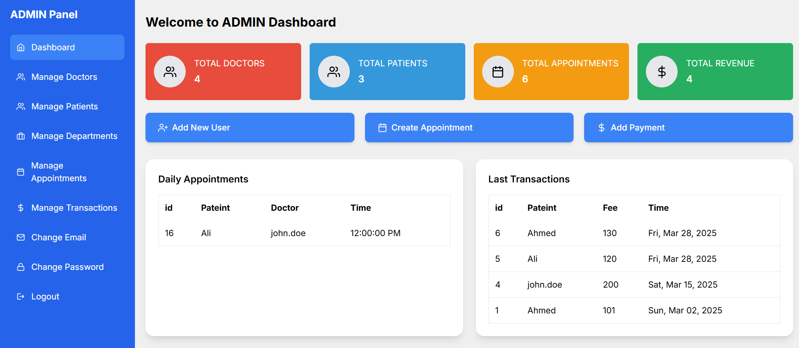
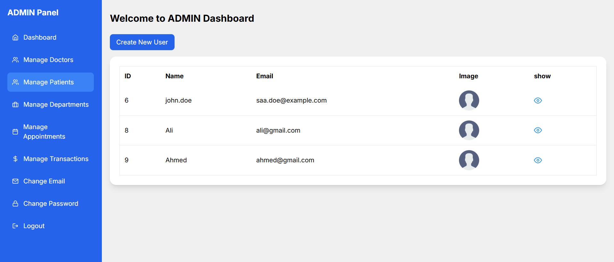
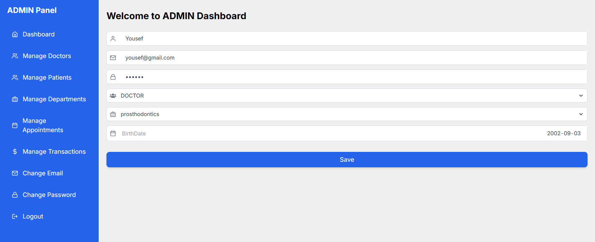
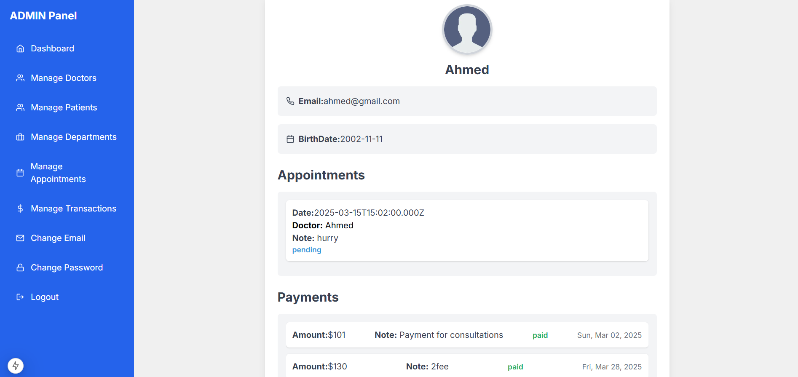
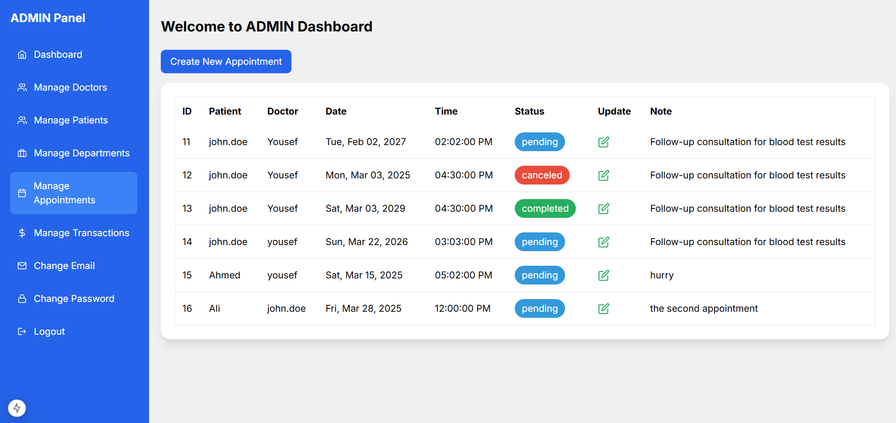
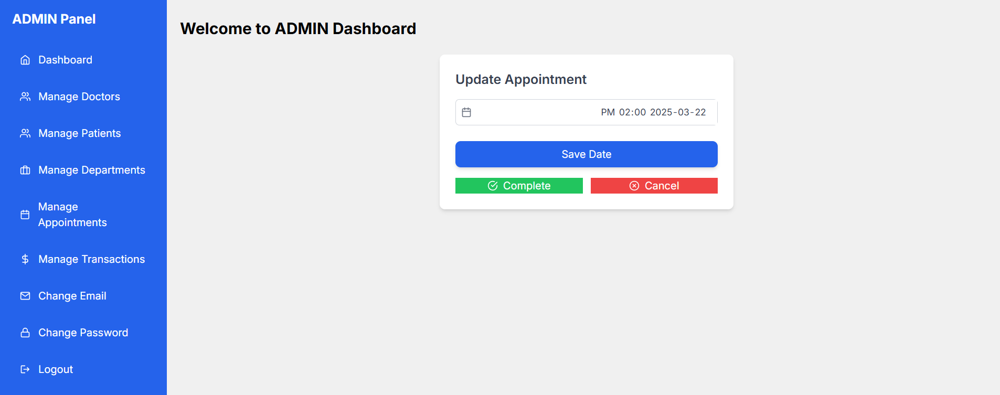
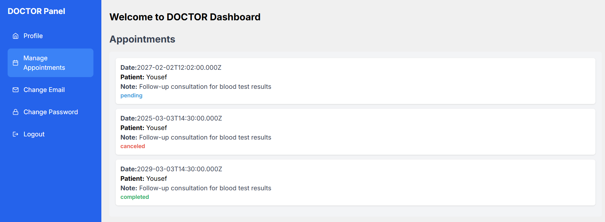

# Dental Clinic Management System

## 📌 Overview
The **Dental Clinic Management System** is a web-based platform designed to streamline appointment scheduling and payment processing for dental clinics. It provides role-based access for **Admins, Doctors, and Patients**, ensuring efficient management of clinic operations.

## 🚀 Features
- **Admin Dashboard**: Manage users, doctors, appointments, and payments.
- **Doctor Panel**: View and manage patient appointments, update treatment details.
- **Patient Portal**: Schedule appointments, view payment history, and receive treatment updates.
- **User Authentication**: Secure login for all stakeholders.

## 🏗️ Tech Stack
- **Frontend**: Next.js
- **Backend**: NestJS (Node.js framework) with Sequelize (ORM)
- **Database**:  MySQL
- **Authentication**: JWT-based authentication


## 🛠️ Installation & Setup
1. **Clone the repository:**
   ```bash
   git clone https://github.com/moh7med2002/clinic_fullstack.git
   cd clinic_fullstack
   ```
2. **Backend Setup:**
   ```bash
   cd server
   npm install
   npm run start
   ```
3. **Frontend Setup:**
   ```bash
   cd client
   npm install
   npm run dev

### Screenshots
Here are some screenshots from Store:









